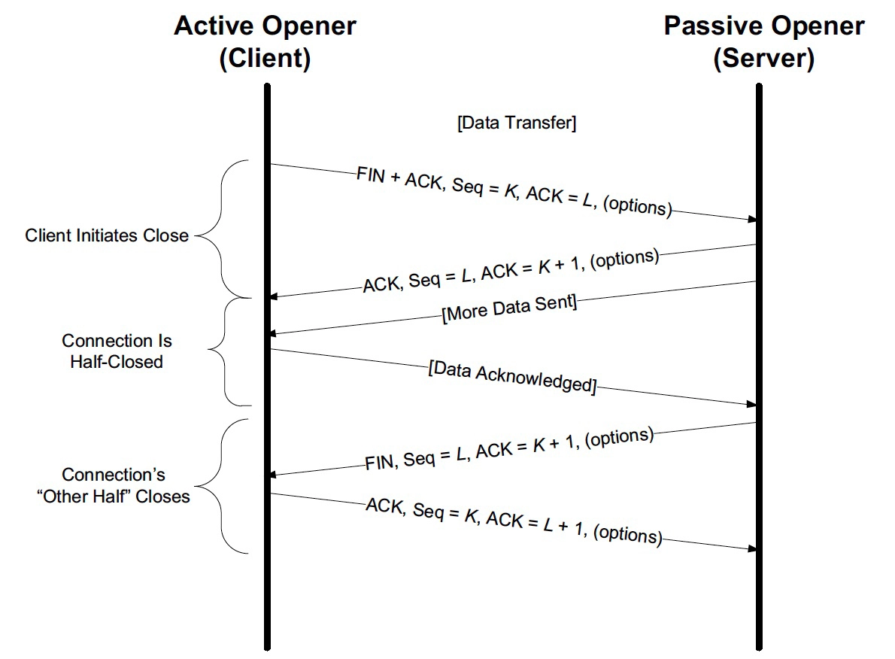
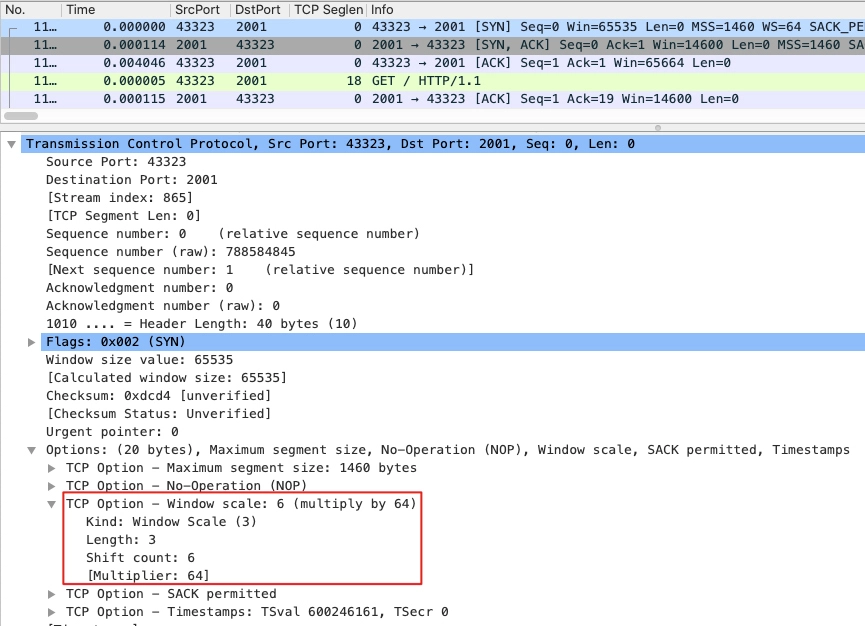
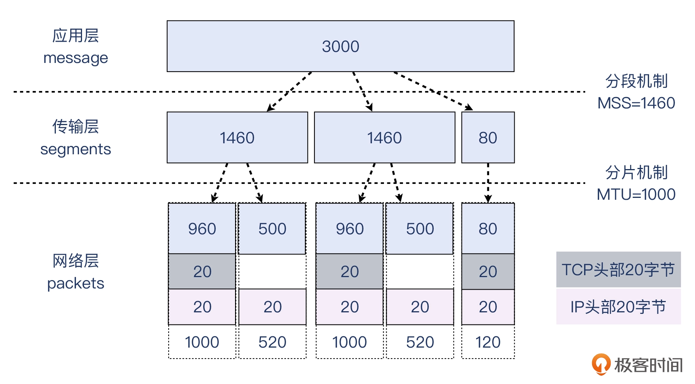
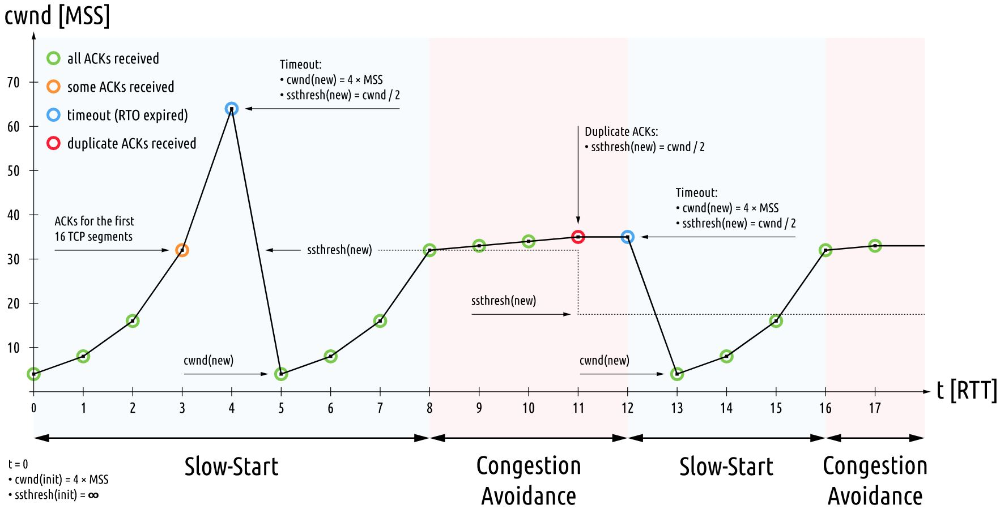
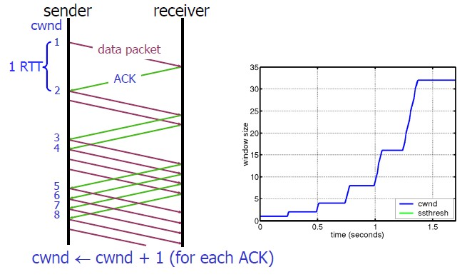
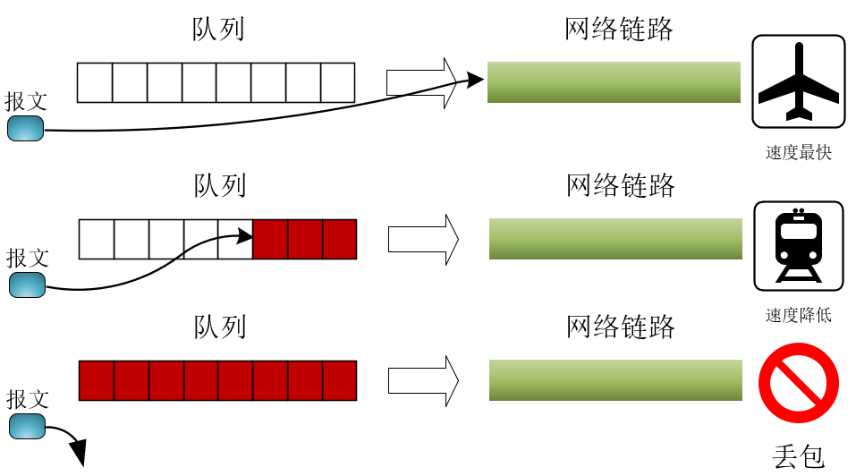
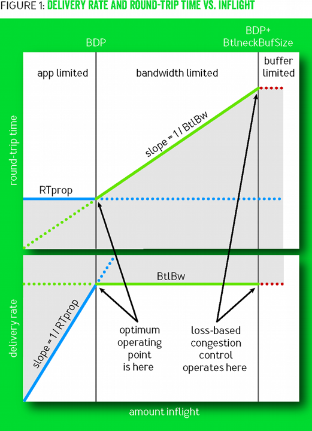

- TCP 的 Segment 是没有 IP 地址的，那是 IP 层的事。但是有源端口和目标端口。
- Sequence Number是包的序号，解决**网络包乱序（reordering）**问题。
- Acknowledgement Number（ACK），用来解决**不丢包**的问题。
- Window(Advertised Window)，滑动窗口（Sliding Window），解决**流量控制**。
- TCP Flag，用于控制 TCP 状态。

## TCP 状态

import TCPStatusPng from './img/TCP-status.png';


## 三次握手


### 第一次握手丢失

客户端未收到 ACK，会重发 SYN 报文，默认重发 6 次。每次超时时间是上次的 2 倍，即指数退避。时间不是精确的整秒，因为指数退避原则上不在精确的整秒做重试，最好是有所浮动。因为每个发送方都会在相同的时间段内重试，会导致它们同时另一次冲突。

第一次的超时时间不同系统不同，写死在内核中，也有 1s 也有 3s 的。

重传次数由内核参数 `tcp_syn_retries` 控制。

```bash
net.ipv4.tcp_syn_retries = 6
```

默认则最长需要等待 1+2+4+8+16+32+64=127 秒，超过 2 分钟。

### 第二次握手丢失

和第一次握手丢失一样，客户端还是重传。

服务端收不到客户端 ACK，也会触发重传。重传次数由内核参数 `tcp_synack_retries` 控制。

```bash
net.ipv4.tcp_synack_retries = 2
```

#### 半连接和全连接队列

[就是要你懂TCP--半连接队列和全连接队列](https://plantegg.github.io/2017/06/07/就是要你懂TCP--半连接队列和全连接队列/)

内核维护 2 个队列：
- 半连接队列（SYN 队列）：收到 SYN 后创建半连接对象，放入内核 SYN 队列
- 全连接队列（Accpet 队列）：收到 ACK 后，从 SYN 队列取出半连接对象，创建全连接对象，放入 Accpet 队列。之后应用调用 accept() 接口从 Accpet 队列取出全连接对象。

默认当队列超过最大长度限制，会丢弃报文。可以选择开启 `tcp_abort_on_overflow = 1` 向客户端发送 RST 复位报文，告诉客户端建立连接失败。不过通常这个值应该设为 0，因为如果服务器只是短暂队列满，那么下次客户端重连时，半连接队列可能是有空位的，仍然能建连成功。

```bash
net.ipv4.tcp_abort_on_overflow = 0
```

##### 查看全连接队列长度

```bash
# head -n 3 表示只显示前面3行
# -l 表示只显示监听套接字
# -n 表示显示数字地址和端口(而不是名字)
# -p 表示显示进程信息
$ netstat -nlp | head -n 3
Active Internet connections (only servers)
Proto Recv-Q Send-Q Local Address           Foreign Address         State       PID/Program name
tcp        0      0 127.0.0.53:53           0.0.0.0:*               LISTEN      840/systemd-resolve

# -l 表示只显示监听套接字
# -t 表示只显示 TCP 套接字
# -n 表示显示数字地址和端口(而不是名字)
# -p 表示显示进程信息
$ ss -ltnp | head -n 3
State    Recv-Q    Send-Q        Local Address:Port        Peer Address:Port
LISTEN   0         128           127.0.0.53%lo:53               0.0.0.0:*        users:(("systemd-resolve",pid=840,fd=13))
LISTEN   0         128                 0.0.0.0:22               0.0.0.0:*        users:(("sshd",pid=1459,fd=3))
```

当套接字处于监听状态（Listening）时，
* Recv-Q 表示全连接队列的长度。
* 而 Send-Q 表示全连接队列的最大长度。

查看全连接溢出报错：
```bash
$ netstat -s | grep "listen queue"
    14 times the listen queue of a socket overflowed
```

没有直接方法观测半连接队列长度，但是可以看到半连接队列溢出后的报错

```bash
$ netstat -s | grep "SYNs to LISTEN"
    1192450 SYNs to LISTEN sockets dropped
```

##### 设置全连接队列长度

系统全连接队列最大长度
```bash
net.core.somaxconn = 1024
```

`listen()` 函数中 `backlog` 参数设置的是当前监听 socket 的全连接队列最大长度。

### 第三次握手丢失

和第二次握手丢失一样，服务端还是重传。

### SYN Flood 攻击
如果客户端恶意发送第一个 SYN 包后不响应，会把服务器 SYNC 连接队列耗尽。其他常常客户端将无法连接。

#### 观测

TODO

#### 解法 1：调大半连接队列最大长度

```bash
net.ipv4.tcp_max_syn_backlog = 1024
```

#### 解法 2：减少服务端 SYN+ACK 的重试次数

```bash
net.ipv4.tcp_synack_retries = 1
```

#### 解法 3：开启 SYN Cookies
SYN Cookies 基于连接信息（包括源地址、源端口、目的地址、目的端口等）以及一个加密种子（如系统启动时间），计算出一个哈希值（SHA1），这个哈希值称为 cookie。

这个 cookie 就被用作序列号，来应答 SYN+ACK 包，并释放连接状态。当客户端发送完三次握手的最后一次 ACK 后，服务器就会再次计算这个哈希值，确认是上次返回的 SYN+ACK 的返回包，才会进入 TCP 的连接状态。

开启 SYN Cookies 后，就不需要维护半开连接状态了，进而也就没有了半连接数的限制。

注意，这时 net.ipv4.tcp_max_syn_backlog 就无效了。

这里 1 表示

```bash
# 1 表示仅当 SYN 半连接队列放不下时，才启用
net.ipv4.tcp_syncookies = 1
```

### SeqNum

Seq 和 Ack 序号的范围都是 32 位 int。

[RFC793](https://datatracker.ietf.org/doc/html/rfc793) 中说，其中 SYN 包的 Inital Sequence Number（ISN）会和一个假的时钟绑在一起，这个时钟会在每 4 微秒对 ISN 做加一操作，直到超过 $2^{32}$，又从 0 开始。这样，一个 ISN 的周期大约是 4.55 个小时。

SeqNum 的增加是和传输的字节数相关的。例如 ISN 为 t，那么三次握手后客户端 SeqNum 为 t+1，这是客户端发送一个 Len：1440 的包，那么下次客户端的 SeqNum 为 t+1441。

每次 AckNum = SeqNum + len（包的大小）。这样发送方明确知道server收到那些东西了。特例是三次握手和四次挥手，虽然 len 都是 0，但是 syn 和 fin 都要占用一个 seq 号，所以这里的 ack 都是 seq+1。总的来说，ACK 确认的是所有小于 ACK 的序列号的包都已经送达，下次可以发送等于 ACK 号的序列的包。

注意第三次握手是可以携带数据的。

### TCP fast open(TFO)

Google 提出了 TCP fast open 方案（简称TFO），客户端可以在首个 SYN 报文中就携带请求，这节省了 1 个 RTT 的时间。

首次建连时正常 3 次握手，但是客户端 SYN 包告诉服务器想使用 TFO 功能，这样服务器会把客户端 IP 地址用自己的秘钥加密，作为 Cookie 在 SYN+ACK 包中返回，Cookie 缓存在客户端。

下次客户端再向服务器建连时，SYN 包中有 Cookie，同时携带应用数据。后续还是会有 2 次握手。不过服务端不用等 ack 就可以返回响应数据。此时客户端代码中不能使用“先 connect 再 write”的方式，只能用 sendto/sendmsg 才行。

```bash
net.ipv4.tcp_fastopen = 3 # 0x01 表示客户端端开启 TFO，0x02表示服务端开启 TFO
```

### 同时发起握手

两端同时发 SYN 包到对方端口，相当于四次握手。


## 四次挥手


### 三次挥手

四次挥手可以变成三次挥手，被动关闭端没有需要发送的包，直接将将 ACK + FIN 放在一个包中。

### 第一次挥手丢失

主动关闭方进入 FIN_WAIT_1 状态，超时收不到 ACK 后重传 FIN 包，次数为 `tcp_orphan_retries`，默认值为 0。

```bash
net.ipv4.tcp_orphan_retries = 0
```

### 第二次挥手丢失

主动关闭方和第一次挥手丢失一样，重传 FIN 包。

被动关闭方进入 `CLOSE_WAIT`，无影响。

### 第三次挥手丢失

被动关闭方如果收不到 ACK，会重发 FIN 报文，重发次数仍然由 `tcp_orphan_retries` 控制。

主动关闭方处于 `FIN_WAIT_2` 状态，如果是通过 close 关闭的（不能再读写），那么 `tcp_fin_timeout` 设置超时（默认60s）后，自动变为 `TIME_WAIT` 状态；如果是通过 shutdown 关闭的，那么将一直处于 `FIN_WAIT_2` 状态。

### 第四次挥手丢失

被动关闭防重发 FIN 包，重发次数仍然由 `tcp_orphan_retries` 控制。

### TIME_WAIT

TIME_WAIT 的超时时间为 **2 * MSL**（[RFC793](https://datatracker.ietf.org/doc/html/rfc793) 定义了 MSL 为 2 分钟，Linux 设置成了 30s）。防止被动关闭方没收到 ACK，触发重发 FIN；也防止当前连接不会和后续连接混在一起。

TIME_WAIT 实际超时时间可通过内核参数 `nf_conntrack_tcp_timeout_time_wait`设置。

```bash
net.netfilter.nf_conntrack_tcp_timeout_time_wait = 30
```

调整 TIME_WAIT 状态最大连接数量。

```bash
net.ipv4.tcp_max_tw_buckets = 1048576
```

HTTP/1.1 后默认支持 Keep-Alive，这样是由客户端主动断开连接，把 TIME_AWAIT 状态留在客户端。

当服务器发送带有 “Connection: Close” 的响应时，客户端在接收完这个响应后，应该关闭与服务器的 TCP 连接，不保持持久连接状态。这时是客户端主动断连长链接。服务端可以借此实现优雅关闭连接，将流量切换到新机器。

### tcp_tw_reuse

RFC 1323 实现了 TCP 扩展，以提高高带宽链路的性能。除此之外，它还定义了一个带有两个四字节时间戳字段的新 TCP 选项，第一个字节是 TCP 发送方的当前时钟时间戳，而第二个字节是从远程主机接收到的最新时间戳。

通过 `net.ipv4.tcp_tw_reuse` 开启后允许将 TIME_WAIT socket 重新用于新的 TCP 连接，注意要和 `tcp_timestamps` 配合使用。

```bash
net.ipv4.tcp_tw_reuse = 1
net.ipv4.tcp_timestamps = 1
```

另一个参数 `net.ipv4.tcp_tw_recycle` 开启表示允许快速回收 TIME_WAIT 连接，此时内核会自动检查时间戳，当客户端处于同一个 NAT 出口时，服务端对于同一个 NAT 的包检查时序，会丢弃时间不同的包，导致丢包。由于坑太多，这个选项在内核的 4.1 版本中已经删除了。

### `SO_LINGER`

设置 socket 选项，来设置调用 close 关闭连接行为。

```c
struct linger so_linger;
so_linger.l_onoff = 1;
so_linger.l_linger = 0;
setsockopt(s, SOL_SOCKET, SO_LINGER, &so_linger,sizeof(so_linger));
```

如果 `l_onoff` 为非 0， 且 `l_linger` 值为 0，那么调用 `close` 后，会立该发送一个 RST 标志给对端，该 TCP 连接将跳过四次挥手，也就跳过了 `TIME_WAIT` 状态，直接关闭。


### shutdown 和 close

close 只是将 fd 引用计数减 1，只有 fd 引用计数为 0 时，才是关闭连接。

`int shutdown(int sockfd, int howto)` 中 howto 参数：
- `SHUT_RD`：关闭读，丢弃 socket 读缓冲区数据。注意此时不会发送 FIN 包。
- `SHUT_WR`：关闭写，socket 写缓冲区数据会在关闭连接之前发出去，应用不能再对 socket 写数据。此时处于半关闭状态
- `SHUT_RDWR`：同时关闭读写。

### 半关闭

四次挥手时，完成两次挥手后，此时处于半关闭状态。被动关闭方仍然可以继续发送数据给另一方，主动关闭方收到数据后仍然可以回复 ACK。



### 孤儿连接

当一方进程异常退出时，内核就会发送 RST 报文来关闭，可以不走四次挥手强行关闭连接，但当报文延迟或者重复传输时，这种方式会导致数据错乱。

如果内核没发出 RST 或者突然断电断网，服务器还维持着连接状态，此时就叫孤儿连接。

另一种定义是当进程调用 close 函数关闭连接后，无论该连接是在 FIN_WAIT1 状态，还是确实关闭了，这个连接都与该进程无关了，它变成了孤儿连接。如果孤儿连接数量大于 `tcp_max_orphans`，新增的孤儿连接将不再走四次挥手，而是直接发送 RST 复位报文强制关闭。

```bash
net.ipv4.tcp_max_orphans = 16384
```

### 双方同时关闭连接

两方发送 FIN 报文时，都认为自己是主动方，所以都进入了 FIN_WAIT1 状态，FIN 报文的重发次数仍由 tcp_orphan_retries 参数控制。此时有新状态 `CLOSING`。

[同时关闭连接](http://www.tcpipguide.com/free/t_TCPConnectionTermination-4.htm)：

 

### ICMP 控制报文

Connection refused 不一定是 TCP 的 RST 导致的，ICMP Destination unreachable (Port unreachable) 报文也可以。抓包的时候如果过滤端口，是抓不到 ICMP 包的，此时会看到明明没有 TCP 任何包但是客户端报错了。

## 重传机制

### 超时重传


#### RTT 算法

在不同网络下，RTT（Round Trip Time）是动态的，因而超时时间 RTO（Retransmission TimeOut）也是动态的。

##### 经典算法

RFC793 中定义的经典算法是这样的：

1. 先采样RTT，记下最近好几次的RTT值。
2. 平滑计算 SRTT（Smoothed RTT），$SRTT = (α \times SRTT) + ((1 - α) \times RTT)$，其中的 $α$ 取值在 0.8 到 0.9 之间，这个叫加权移动平均（Exponential weighted moving average）。
3. 计算 RTO，$ RTO=\min(UBOUND, \max(LBOUND, \beta \times SRTT)) $
    - UBOUND：timeout 上限
    - LBOUND：timeout 下限
    - β 值一般在 1.3 到 2.0 之间

##### Karn / Partridge 算法

TODO

##### Jacobson / Karels 算法

TODO


### 快速重传

Fast Retransmit 算法，不以时间驱动，而以数据驱动重传。如果，包没有连续到达，就 ack 最后那个可能被丢了的包，如果发送方连续收到 3 次相同的 ack，就重传。Fast Retransmit 的好处是不用等 timeout 了再重传。

### SACK 方法

Selective Acknowledgment (SACK)（[RFC 2018](http://tools.ietf.org/html/rfc2018)），在 TCP 头里加一个 SACK 的东西，ACK 还是 Fast Retransmit 的 ACK，SACK 则是汇报收到的数据碎版。

这样，在发送端就可以根据回传的 SACK 来知道哪些数据到了，哪些没有到。这个协议需要两边都支持。`net.ipv4.tcp_sack` 参数打开这个功能（Linux 2.4后默认打开）。

接收方 Reneging 问题，接收方有权把已经报给发送端的 SACK 里的数据丢弃。比如接收方要把内存给别的更重要的东西。发送方也不能完全依赖 SACK，还是要依赖 ACK，并维护 Time-Out，如果后续的 ACK 没有增长，那么还是要把 SACK 的东西重传。，另外，接收端这边永远不能把 SACK 的包标记为Ack。

SACK 会消费发送方的资源，参考[TCP SACK的性能权衡](https://www.cnblogs.com/lovemyspring/articles/4270318.html)。

### Duplicate SACK – 重复收到数据的问题

Duplicate SACK 又称 D-SACK，其主要使用了 SACK 来告诉发送方有哪些数据被重复接收了。

引入了 D-SACK，可以让发送方知道，是发出去的包丢了，还是回来的 ACK 包丢了。网络上出现了先发的包后到的情况（又称 reordering）。

## TCP 滑动窗口

TCP通过Sliding Window来做流控（Flow Control）。


- 接收端 LastByteRead 指向了 TCP 缓冲区中读到的位置，NextByteExpected 指向的地方是收到的连续包的最后一个位置，LastByteRcved 指向的是收到的包的最后一个位置，我们可以看到中间有些数据还没有到达，所以有数据空白区。
- 发送端的 LastByteAcked 指向了被接收端 Ack 过的位置（表示成功发送确认），LastByteSent 表示发出去了，但还没有收到成功确认的Ack，LastByteWritten 指向的是上层应用正在写的地方。

### 接收方 AdvertisedWindow

- 接收端在给发送端回 ACK 中会汇报自己的 AdvertisedWindow = MaxRcvBuffer – LastByteRcved – 1
- 发送方会根据这个窗口来控制发送数据的大小，以保证接收方可以处理

### 发送方滑动窗口


上图中分成了四个部分，分别是：（其中那个黑色矩形就是滑动窗口）
- #1已收到ack确认的数据。
- #2发还没收到ack的。
- #3在窗口中还没有发出的（接收方还有空间）。
- #4窗口以外的数据（接收方没空间）

下面是个滑动后的示意图（收到36的ack，并发出了46-51的字节）：


### Zero Window

如果发送端 Window 变成 0 了，发送端就不发数据了。如果发送端不发数据了，接收方一会儿 Window size 可用了，怎么通知发送端呢？

TCP使用了 Zero Window Probe技术，缩写为 ZWP，也就是说，发送端在窗口变成 0 后，会发 ZWP 的包给接收方，让接收方来 ack 他的 Window 尺寸，一般这个值会设置成 3 次，第1次大约30-60秒（不同的实现可能会不一样）。如果3次过后还是0的话，有的 TCP 实现就会发RST把链接断了。

只要有等待的地方都可能出现DDoS攻击，Zero Window也不例外，一些攻击者会在和HTTP建好链发完GET请求后，就把Window设置为0，然后服务端就只能等待进行ZWP，于是攻击者会并发大量的这样的请求，把服务器端的资源耗尽。（参考[SockStress](https://www.wikiwand.com/en/articles/Sockstress)）

### Silly Window Syndrome（糊涂窗口综合症）

如果接收端压力太大，导致发送端窗口非常小，这样只要一腾出来一点空间，发送方就会发送小包。远远达不到 MTU，要知道 TCP + IP 头就有 40 字节，有效载荷太低就是浪费。MSS（Max Segment Size），TCP 默认是 536， [RFC 791](http://tools.ietf.org/html/rfc791)里说任何一个 IP 设备都得最少接收 576 尺寸的大小（实际上来说576是拨号的网络的MTU，而576减去IP头的20个字节就是536）。

解决方法：

- 接收端使用 David D Clark’s 方案，接收端收到的数据导致 window size 小于某个值，直接 ack(0) 给发送端，阻止发送端发数据。等接收端处理一些数据 window size >= MSS，或者，receiver buffer 有一半为空，就可以把 window 打开让发送方发送数据。
- 发送端使用 Nagle’s 算法，发送数据触发条件（2 选 1）：
    - 等 window size >= MSS 或 Data Size >= MSS
    - 收到 ACK

Nagle 算法默认是打开的。对于一些需要小包场景的程序，比如像 telnet 或 ssh 这样的交互性比较强的程序，需要关闭这个算法。在 Socket 设置 `TCP_NODELAY` 选项来关闭这个算法。

```c
setsockopt(sock_fd, IPPROTO_TCP, TCP_NODELAY, (char *)&value,sizeof(int));
```

`TCP_CORK` 是更激进的 Nagle 算法，完全禁止小包发送，而 Nagle 算法没有禁止小包发送，只是禁止了大量的小包发送。

### delay ack

延迟确认（Delayed ACK）是针对 TCP ACK 的一种优化机制，也就是说，不用每次请求都发送一个 ACK，而是先等一会儿（比如 40ms），看看有没有“顺风车”。如果这段时间内，正好有其他包需要发送，那就捎带着 ACK 一起发送过去。当然，如果一直等不到其他包，那就超时后单独发送 ACK。

只有 TCP 套接字专门设置了 `TCP_QUICKACK` ，才会开启快速确认模式；否则，默认情况下，采用的就是延迟确认机制：

```bash
TCP_QUICKACK (since Linux 2.4.4)
              Enable  quickack mode if set or disable quickack mode if cleared.  In quickack mode, acks are sent imme‐
              diately, rather than delayed if needed in accordance to normal TCP operation.  This flag is  not  perma‐
              nent,  it only enables a switch to or from quickack mode.  Subsequent operation of the TCP protocol will
              once again enter/leave quickack mode depending on internal  protocol  processing  and  factors  such  as
              delayed ack timeouts occurring and data transfer.  This option should not be used in code intended to be
              portable.
```

当客户端启动 Nagle，服务端启用 Delayed ack，就会出现问题。服务端等待新报文顺便一起 ack，而客户端小包没有收到 ack 不发送，互相等待，直到服务端超时 40ms 后才 ack。这是经典的 [Nagle 问题](https://plantegg.github.io/2018/06/14/就是要你懂TCP--最经典的TCP性能问题/)。

### 扩充窗口

窗口字段只有 2 个字节，因此它最多能表达 216 即 65535 字节大小的窗口。在 RTT 为 10ms 的网络中也只能到达 6MB/s 的最大速度。

[RFC1323](https://tools.ietf.org/html/rfc1323) 定义了扩充窗口的方法，在 TCP Options 里面，增加一个 Window Scale 的字段，它表示原始 Window 值的左移位数，最高可以左移 14 位。

Linux 中打开这一功能，需要把 `tcp_window_scaling` 配置设为 1，此时窗口的最大值可以达到 1GB（230）。

```bash
net.ipv4.tcp_window_scaling = 1
```

如果抓包就会看到貌似发送数据字节比接受窗口还大。




* Kind：这个值是 3，每个 TCP Option 都有自己的编号，3 代表这是 Window Scale 类型。
* Length：3 字节，含 Kind、Length（自己）、Shift count。
* Shift count：6，也就是我们最为关心的窗口将要被左移的位数，2 的 6 次方就是 64。
* 只有 SYN 包中才有这个 option，因为一个连接是不会变的。另外 SYN 包中窗口不会放大。

### 带宽时延积(BDP, Bandwidth Delay Product)

带宽跟往返时间（RTT）相乘，就是在空中飞行的报文的最大数量，即带宽时延积。注意这里是 RTT 不是 RTT/2，因为对于发送方来说，以 ACK 为准。

实际上更准确的是：

$$
inflightData = (latestSequenceSent + latestLenSent) - maxAckReceived
$$

假设最新发送的数据包序列号为 1000，长度为 50，而接收方已确认接收的最大序列号为 980，那么 inflightData = (1000 + 50) - 980 = 70，表示有 70 个单位的数据正在传输中，尚未得到接收方的确认。

速度上限 = 发送窗口 / 往返时间。用英文可以表示为：velocity = window/RTT。

当最大带宽是 100MB/s、网络时延是 10ms 时，这意味着客户端到服务器间的网络一共可以存放 100MB/s * 0.01s = 1MB 的字节。这个 1MB 是带宽与时延的乘积，所以它就叫做带宽时延积。这 1MB 字节存在于飞行中的 TCP 报文，它们就在网络线路、路由器等网络设备上。如果飞行报文超过了 1MB，就一定会让网络过载，最终导致丢包。

由于发送缓冲区决定了发送窗口的上限，而发送窗口又决定了已发送但未确认的飞行报文的上限，因此，发送缓冲区不能超过带宽时延积，因为超出的部分没有办法用于有效的网络传输，且飞行字节大于带宽时延积还会导致丢包；而且，缓冲区也不能小于带宽时延积，否则无法发挥出高速网络的价值。

Linux 的缓冲区动态调节功能。其中，缓冲区的调节范围是可以设置的。先来看发送缓冲区，它的范围通过 `tcp_wmem` 配置，第 1 个数值是动态范围的下限，第 3 个数值是动态范围的上限，而中间第 2 个数值，则是初始默认值。
```bash
net.ipv4.tcp_wmem = 4096        16384   4194304
```

发送缓冲区完全根据需求自行调整。比如，一旦发送出的数据被确认，而且没有新的数据要发送，就可以把发送缓冲区的内存释放掉。而接收缓冲区的调整就要复杂一些，先来看设置接收缓冲区范围的 `tcp_rmem`，同 `tcp_wmem`。接收缓冲区由于只能被动地等待接收数据，它该如何自动调整呢？可以依据空闲系统内存的数量来调节接收窗口。如果系统的空闲内存很多，就可以把缓冲区增大一些，这样传给对方的接收窗口也会变大，因而对方的发送速度就会通过增加飞行报文来提升。反之，内存紧张时就会缩小缓冲区，这虽然会减慢速度，但可以保证更多的并发连接正常工作。

```bash
net.ipv4.tcp_rmem = 4096        87380   6291456
```
发送缓冲区的调节功能是自动开启的，而接收缓冲区则需要配置 tcp_moderate_rcvbuf 为 1 来开启调节功能：
```bash
net.ipv4.tcp_moderate_rcvbuf = 1
```

接收缓冲区调节时，怎么判断空闲内存的多少呢？这是通过 tcp_mem 配置完成的。tcp_mem 的 3 个值，是 Linux 判断系统内存是否紧张的依据。当 TCP 内存小于第 1 个值时，不需要进行自动调节；在第 1 和第 2 个值之间时，内核开始调节接收缓冲区的大小；大于第 3 个值时，内核不再为 TCP 分配新内存，此时新连接是无法建立的。
```bash
net.ipv4.tcp_mem = 88560        118080  177120
```

在高并发服务器中，为了兼顾网速与大量的并发连接，**我们应当保证缓冲区的动态调整上限达到带宽时延积，而下限保持默认的 4K 不变即可。而对于内存紧张的服务而言，调低默认值是提高并发的有效手段**。

如果这是网络 IO 型服务器，那么，调大 tcp_mem 的上限可以让 TCP 连接使用更多的系统内存，这有利于提升并发能力。需要注意的是，`tcp_wmem` 和 `tcp_rmem` 的单位是字节，而 `tcp_mem` 的单位是页面大小。而且，千万不要在 socket 上直接设置 `SO_SNDBUF` 或者 `SO_RCVBUF`，这样会关闭缓冲区的动态调整功能。

### MSS（Max Segment Size）

MTU 是三层报文的大小，在 MTU 的基础上刨去 IP 头部 20 字节和 TCP 头部 20 字节，就得到了最常见的 MSS 1460 字节。

**在 TCP 这一层，分段的对象是应用层发给 TCP 的消息体（message）**。比如应用给 TCP 协议栈发送了 3000 字节的消息，那么 TCP 发现这个消息超过了 MSS（常见值为 1460），就必须要进行分段，比如可能分成 1460，1460，80 这三个 TCP 段。


**在 IP 这一层，分片的对象是 IP 包的载荷**，它可以是 TCP 报文，也可以是 UDP 报文，还可以是 IP 层自己的报文比如 ICMP。

假设一个“奇葩”的场景，也就是 MSS 为 1460 字节，而 MTU 却只有 1000 字节，那么 segmentation 和 fragmentation 将按照如下示意图来工作：



> 我们假设 TCP 头部就是没有 Option 扩展的 20 字节。但实际场景里，很可能 MSS 小于 1460 字节，而 TCP 头部也超过 20 字节。

机发出的 1500 字节的报文，不能设置 **DF（Don’t Fragment）位**，否则它既超过了 1000 这个路径最小 MTU，又不允许分片，那么网络设备只能把它丢弃。

现在我们假设主机发出的报文是不带 DF 位的，这台网络设备会把它切分为一个 1000（也就是 960+20+20）字节的报文和一个 520（也就是 500+20）字节的报文。1000 字节的 IP 报文的 **MF 位（More Fragment）**会设置为 1，表示后续还有更多分片，而 520 字节的 IP 报文的 MF 字段为 0。

接收端收到第一个 IP 报文时发现 MF 是 1，就会等第二个 IP 报文到达，又因为第二个报文的 MF 是 0，那么结合第二个报文的 fragment offset 信息（这个报文在分片流中的位置），就把这两个报文重组为一个新的完整的 IP 报文，然后进入正常处理流程，也就是上报给 TCP。

**IP 分片是需要尽量避免**，因为路由各个环节未必会完全遵照所有的约定。通常设备收到一个超过其 MTU 的报文会发出 Destination Unreachable 的 ICMP 消息，但由于网络的复杂性， ICMP 消息经常会被拦截，导致发送端压根不知道自己的报文因为 MTU 超限而被丢弃了。比如你发出了大于 PMTU（Path MTU，路径最大传输单元） 的报文，寄希望于 MTU 较小的那个网络环节为你做分片，但事实上它可能不做分片，而是直接丢弃。就算如实分片了，也会增加延迟。Linux 默认配置就是 IP 报文都设置了 DF 位。

### TSO（TCP Segmentation Offload）

内核给 TCP 分段也会消耗 CPU，现在的网卡可以支持 TSO（TCP Segmentation Offload），所谓卸载 CPU 负担，由网卡来做。

TSO 启用后，抓包看到的发送出去的报文可能会超过 MSS，实际网络上的包没有这么大，只是多个小包拼成的。同样的，在接收报文的方向，我们也可以启用 GRO（Generic Receive Offload）。

比如下图中，TCP 载荷就有 2800 字节。


## 拥塞处理（Congestion Handling）

关于拥塞控制的论文请参看[《Congestion Avoidance and Control》](https://ee.lbl.gov/papers/congavoid.pdf)。



拥塞控制主要是四个算法：1）**慢启动**，2）**拥塞避免**，3）**拥塞发生**，4）**快速恢复**。

### 慢热启动 – Slow Start

拥塞窗口（全称为 congestion window，缩写为 CWnd，类似地，接收窗口叫做 rwnd，发送窗口叫做 swnd）。

发送窗口则应当是拥塞窗口与对方接收窗口的最小值：
```
swnd = min(cwnd, rwnd)
```
虽然窗口的计量单位是字节，但为了方便理解，通常我们用 MSS 作为描述窗口大小的单位，其中 MSS 是 TCP 报文的最大长度。

通过 ss 命令查看当前拥塞窗口：
```bash
$ ss -nli|fgrep cwnd
         cubic rto:1000 mss:536 cwnd:10 segs_in:10621866 lastsnd:1716864402 lastrcv:1716864402 lastack:1716864402
```
通过 ip route change 命令修改初始拥塞窗口：
```bash
$ ip route | while read r; do
           ip route change $r initcwnd 10;
       done
```

慢启动的算法如下(cwnd 全称 Congestion Window)：

1. 连接建好的开始先初始化 cwnd = 1，表明可以传一个 MSS 大小的数据。
2. 每当收到一个 ACK，cwnd+=1; 呈线性上升（效果上体现为步骤 3，例如假设当前 cwnd 为 4，那么一个 RTT 内收到 4 个 ACK，cwnd 变为 8）
3. 每当过了一个 RTT，cwnd = cwnd*2; 呈指数让升
4. 还有一个ssthresh（slow start threshold），是一个上限，当cwnd >= ssthresh时，就会进入“拥塞避免算法”

如果网速很快的话，ACK 也会返回得快，RTT 也会短，那么，这个慢启动就一点也不慢。



当 MSS 是 1KB 时，多数 HTTP 请求至少包含 10 个报文，即使以指数级增加拥塞窗口，也需要至少 4 个 RTT 才能传输完。

Google的论文[《An Argument for Increasing TCP’s Initial Congestion Window》](https://static.googleusercontent.com/media/research.google.com/zh-CN//pubs/archive/36640.pdf)。Linux 3.0 后采用了这篇论文的建议，把 cwnd 初始化成了 10 个 MSS。 而Linux 3.0以前，比如 2.6，Linux 采用了 [RFC3390](https://www.rfc-editor.org/rfc/rfc3390.txt)，cwnd 是跟 MSS 的值来变的，如果 MSS < 1095，则 cwnd = 4；如果 MSS > 2190，则 cwnd = 2；其它情况下，则是3。

近年来谷歌提出的 BBR 拥塞控制算法已经应用在高版本的 Linux 内核中。

### 拥塞避免算法 – Congestion Avoidance 

当 cwnd >= ssthresh时，就会进入“拥塞避免算法”。此时，我们知道了多大的窗口会导致拥塞，因此可以把慢启动阈值设为发生拥塞前的窗口大小。

不同的拥塞控制算法降低速度的幅度并不相同，比如 CUBIC 算法会把拥塞窗口降为原先的 0.8 倍（也就是发送速度降到 0.8 倍）。

一般来说 ssthresh 的值是 65535，单位是字节，当cwnd达到这个值时后，算法如下：

1. 收到一个 ACK 时，cwnd = cwnd + 1/cwnd
2. 当每过一个 RTT 时，cwnd = cwnd + 1

### 拥塞状态时的算法

当丢包的时候，会有两种情况：

1. 等到 RTO 超时，重传数据包。TCP 认为这种情况太糟糕，反应也很强烈。
    - sshthresh =  cwnd /2
    - cwnd 重置为 1
    - 进入慢启动过程
2. 快速重传（Fast Retransmit） 算法，也就是在收到 3 个 duplicate ACK 时就开启重传，而不用等到 RTO 超时。
    - TCP Tahoe 的实现和 RTO 超时一样
    - TCP Reno 的实现是：
        - cwnd = cwnd /2
        - sshthresh = cwnd
        - 进入快速恢复算法 Fast Recovery

看到 RTO 超时后，sshthresh 会变成 cwnd 的一半，这意味着，如果 `cwnd <= sshthresh` 时出现的丢包，那么 TCP 的 sshthresh 就会减了一半，然后等 cwnd 又很快地以指数级增涨爬到这个地方时，就会成慢慢的线性增涨。我们可以看到，TCP 是怎么通过这种强烈地震荡快速而小心得找到网站流量的平衡点的。

### 快速恢复算法 – Fast Recovery

快速重传和快速恢复算法一般同时使用。快速恢复算法是认为，你还有 3 个 Duplicated Acks 说明网络也不那么糟糕，所以没有必要像 RTO 超时那么强烈。
当连续收到 3 个重复 ACK 时，发送方便得到了网络发生拥塞的明确信号，通过重复 ACK 报文的序号，我们知道丢失了哪个报文，这样，不等待定时器的触发，立刻重发丢失的报文，可以让发送速度下降得慢一些，这就是快速重传算法。

注意，正如前面所说，进入 Fast Recovery 之前，cwnd 和 sshthresh 已被更新：
- cwnd = cwnd /2
- sshthresh = cwnd

真正的 Fast Recovery 算法如下：
- cwnd = sshthresh  + 3 * MSS （3的意思是确认有3个数据包被收到了）
- 重传 Duplicated ACKs 指定的数据包
- 如果再收到 duplicated Acks，那么 cwnd = cwnd + 1
- 如果收到了新的 Ack，那么，cwnd = sshthresh ，然后就进入了拥塞避免的算法了

这个算法也有问题，那就是它依赖于 3 个重复的 Acks

3个重复的 Acks 并不代表只丢了一个数据包，很有可能是丢了好多包。但这个算法只会重传一个，而剩下的那些包只能等到 RTO 超时，于是，进入了恶梦模式——超时一个窗口就减半一下，多个超时会超成 TCP 的传输速度呈级数下降，而且也不会触发 Fast Recovery 算法了。


慢启动、拥塞避免、快速重传、快速恢复，共同构成了拥塞控制算法。Linux 上提供了更改拥塞控制算法的配置，你可以通过 tcp_available_congestion_control 配置查看内核支持的算法列表：

```bash
net.ipv4.tcp_available_congestion_control = cubic reno
```

再通过 tcp_congestion_control 配置选择一个具体的拥塞控制算法：
```bash
net.ipv4.tcp_congestion_control = cubic
```

## 基于测量的拥塞控制算法

传统拥塞控制算法以丢包作为判断拥塞的依据。但是当今网络设备的缓存越来越大，导致丢包这个行为不像以前缓存小的时代那么频繁，但是报文延迟的问题比以前严重了。所以，要更加准确地探测拥塞，我们应该更多地关注延迟，并基于延迟的变化作出拥塞窗口的调整。

网络刚出现拥塞时并不会丢包，而真的出现丢包时，拥塞已经非常严重了。如下图所示，像路由器这样的网络设备，都会有缓冲队列应对突发的、超越处理能力的流量：



当缓冲队列为空时，传输速度最快。一旦队列开始积压，每个报文的传输时间需要增加排队时间，网速就变慢了。而当队列溢出时，才会出现丢包，基于丢包的拥塞控制算法在这个时间点进入拥塞避免阶段，显然太晚了。因为升高的网络时延降低了用户体验，而且从丢包到重发这段时间，带宽也会出现下降。

**进行拥塞控制的最佳时间点，是缓冲队列刚出现积压的时刻，此时，网络时延会增高，但带宽维持不变**，这两个数值的变化可以给出明确的拥塞信号，如下图所示：



这种以测量带宽、时延来确定拥塞的方法，在丢包率较高的网络中应用效果尤其好。2016 年 Google 推出的 BBR 算法（全称 Bottleneck Bandwidth and Round-trip propagation time），就是测量驱动的拥塞控制算法，它在 YouTube 站点上应用后使得网络时延下降了 20% 以上，传输带宽也有 5% 左右的提升。

当然，测量驱动的拥塞算法并没有那么简单，因为网络会波动，线路也会变化，算法必须及时地响应网络变化，详见[一文解释清楚Google BBR拥塞控制算法原理](https://www.taohui.pub/2019/08/07/网络协议/一文解释清楚google-bbr拥塞控制算法原理/)

Linux 4.9 版本之后都支持 BBR 算法，开启 BBR 算法仍然使用 tcp_congestion_control 配置：
```bash
net.ipv4.tcp_congestion_control=bbr
```

BBR 在高 RT 场景更有优势，跨地域的广域网或者网络状况不稳定的环境下，BBR 能够较好地探测网络的实际带宽和延迟，动态调整发送速率，避免过度拥塞。机房内网通常具有低延迟、高带宽且相对稳定的特点。在这种环境下，一些传统的拥塞控制算法可能已经能够很好地适应网络状况，而 BBR 由于其复杂的探测和调整机制，可能会出现一些不必要的开销，甚至在某些情况下可能不如传统算法高效。

