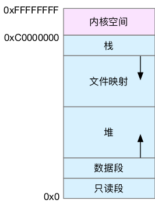

## 进程内存地址空间


页表存储在 CPU 的内存管理单元 MMU 中，正常情况下，处理器就可以直接通过硬件，找出要访问的内存。

而当进程访问的虚拟地址在页表中查不到时，系统会产生一个**缺页异常**，进入内核空间分配物理内存、更新进程页表，最后再返回用户空间，恢复进程的运行。

**TLB 其实就是 MMU 中页表的高速缓存**。由于进程的虚拟地址空间是独立的，而 TLB 的访问速度又比 MMU 快得多，所以，通过减少进程的上下文切换，减少 TLB 的刷新次数，就可以提高 TLB 缓存的使用率，进而提高 CPU 的内存访问性能。

不过要注意，MMU 并不以字节为单位来管理内存，而是规定了一个内存映射的最小单位，也就是页，通常是 **4 KB** 大小。这样，每一次内存映射，都需要关联 4 KB 或者 4KB 整数倍的内存空间。

页的大小只有 4 KB ，导致的另一个问题就是，整个页表会变得非常大。比方说，仅 32 位系统就需要 100 多万个页表项（4GB/4KB），才可以实现整个地址空间的映射。为了解决页表项过多的问题，Linux 提供了两种机制，也就是**多级页表**和**大页（HugePage）**。

多级页表就是把内存分成区块来管理，将原来的映射关系改成区块索引和区块内的偏移。由于虚拟内存空间通常只用了很少一部分，那么，多级页表就只保存这些使用中的区块，这样就可以大大地减少页表的项数。

Linux 用的正是四级页表来管理内存页，如下图所示，虚拟地址被分为 5 个部分，前 4 个表项用于选择页，而最后一个索引表示页内偏移。


再看大页，顾名思义，就是比普通页更大的内存块，常见的大小有 2MB 和 1GB。大页通常用在使用大量内存的进程上，比如 Oracle、DPDK 等。




用户空间内存，从低到高分别是五种不同的内存段。
* 只读段，包括代码和常量等。
* 数据段，包括全局变量等。
* 堆，包括动态分配的内存，从低地址开始向上增长。
* 文件映射段，包括动态库、共享内存等，从高地址开始向下增长。
* 栈，包括局部变量和函数调用的上下文等。栈的大小是固定的，一般是 8 MB。

在这五个内存段中，堆和文件映射段的内存是动态分配的。比如说，使用 C 标准库的 malloc() 或者 mmap() ，就可以分别在堆和文件映射段动态分配内存。

## 内存分配与回收

malloc() 是 C 标准库提供的内存分配函数，对应到系统调用上，有两种实现方式，即 `brk()` 和 `mmap()`。

* 对小块内存（小于 128K），C 标准库使用 brk() 来分配，也就是通过移动堆顶的位置来分配内存。这些内存释放后并不会立刻归还系统，而是被缓存起来，这样就可以重复使用。
* 而大块内存（大于 128K），则直接使用内存映射 mmap() 来分配，也就是在文件映射段找一块空闲内存分配出去。

brk() 方式的缓存，可以减少缺页异常的发生，提高内存访问效率。不过，由于这些内存没有归还系统，在内存工作繁忙时，频繁的内存分配和释放会造成内存碎片。

mmap() 方式分配的内存，会在释放时直接归还系统，所以每次 mmap 都会发生缺页异常。在内存工作繁忙时，频繁的内存分配会导致大量的缺页异常，使内核的管理负担增大。这也是 malloc 只对大块内存使用 mmap  的原因。

当这两种调用发生后，其实并没有真正分配内存。这些内存，都只在首次访问时才分配，也就是通过缺页异常进入内核中，再由内核来分配内存。

整体来说，Linux 使用伙伴系统来管理内存分配。前面我们提到过，这些内存在 MMU 中以页为单位进行管理，伙伴系统也一样，以页为单位来管理内存，并且会通过相邻页的合并，减少内存碎片化（比如 brk 方式造成的内存碎片）。

在用户空间，malloc 通过 brk() 分配的内存，在释放时并不立即归还系统，而是缓存起来重复利用。在内核空间，Linux 则通过 slab 分配器来管理小内存。你可以把 slab 看成构建在伙伴系统上的一个缓存，主要作用就是分配并释放内核中的小对象。

系统也不会任由某个进程用完所有内存。在发现内存紧张时，系统就会通过一系列机制来回收内存，比如下面这三种方式：

* 回收缓存，比如使用 LRU（Least Recently Used）算法，回收最近使用最少的内存页面；
* 回收不常访问的内存，把不常用的内存通过交换分区直接写到磁盘中；
* 杀死进程，内存紧张时系统还会通过 OOM（Out of Memory），直接杀掉占用大量内存的进程。

第二种方式回收不常访问的内存时，会用到交换分区（以下简称 Swap）。Swap 其实就是把一块磁盘空间当成内存来用。它可以把进程暂时不用的数据存储到磁盘中（这个过程称为换出），当进程访问这些内存时，再从磁盘读取这些数据到内存中（这个过程称为换入）。

你可以发现，Swap 把系统的可用内存变大了。不过要注意，通常只在内存不足时，才会发生 Swap 交换。并且由于磁盘读写的速度远比内存慢，Swap 会导致严重的内存性能问题。

第三种方式提到的  OOM（Out of Memory），其实是内核的一种保护机制。它监控进程的内存使用情况，并且使用 oom_score 为每个进程的内存使用情况进行评分：

* 一个进程消耗的内存越大，oom_score 就越大；
* 一个进程运行占用的 CPU 越多，oom_score 就越小。

为了实际工作的需要，管理员可以通过 /proc 文件系统，手动设置进程的 oom_adj ，从而调整进程的 oom_score。

oom_adj 的范围是 [-17, 15]，数值越大，表示进程越容易被 OOM 杀死；数值越小，表示进程越不容易被 OOM 杀死，其中 -17 表示禁止 OOM。

比如用下面的命令，你就可以把 sshd 进程的 oom_adj 调小为 -16，这样， sshd 进程就不容易被 OOM 杀死。

```shell
echo -16 > /proc/$(pidof sshd)/oom_adj
```

## 查看内存使用情况

```shell
# 注意不同版本的free输出可能会有所不同
$ free
              total        used        free      shared  buff/cache   available
Mem:        8169348      263524     6875352         668     1030472     7611064
Swap:             0           0           0
```

- used 是已使用内存的大小，包含了共享内存；
- buff/cache 是缓存和缓冲区的大小；
- available 是新进程可用内存的大小。available 不仅包含未使用内存，还包括了可回收的缓存，所以一般会比未使用内存更大。不过，并不是所有缓存都可以回收，因为有些缓存可能正在使用中。

```shell
# 按下 M 切换到内存排序
$ top
...
KiB Mem :  8169348 total,  6871440 free,   267096 used,  1030812 buff/cache
KiB Swap:        0 total,        0 free,        0 used.  7607492 avail Mem


  PID USER      PR  NI    VIRT    RES    SHR S  %CPU %MEM     TIME+ COMMAND
  430 root      19  -1  122360  35588  23748 S   0.0  0.4   0:32.17 systemd-journal
 1075 root      20   0  771860  22744  11368 S   0.0  0.3   0:38.89 snapd
 1048 root      20   0  170904  17292   9488 S   0.0  0.2   0:00.24 networkd-dispat
    1 root      20   0   78020   9156   6644 S   0.0  0.1   0:22.92 systemd
12376 azure     20   0   76632   7456   6420 S   0.0  0.1   0:00.01 systemd
12374 root      20   0  107984   7312   6304 S   0.0  0.1   0:00.00 sshd
...
```

- **VIRT** 是进程虚拟内存的大小，只要是进程申请过的内存，即便还没有真正分配物理内存，也会计算在内。
- **RES** 是常驻内存的大小，也就是进程实际使用的物理内存大小，但不包括 Swap 和共享内存。
- **SHR** 是共享内存的大小，比如与其他进程共同使用的共享内存、加载的动态链接库以及程序的代码段等。共享内存 SHR 并不一定是共享的，比方说，程序的代码段、非共享的动态链接库，也都算在 SHR 里。当然，SHR 也包括了进程间真正共享的内存。所以在计算多个进程的内存使用时，不要把所有进程的 SHR 直接相加得出结果。
- **%MEM** 是进程使用物理内存占系统总内存的百分比。

## 如何统计所有进程的物理内存使用量

RSS 表示常驻内存，把进程用到的共享内存也算了进去。所以，直接累加会导致共享内存被重复计算，不能得到准确的答案。

每个进程的 PSS ，是指把共享内存平分到各个进程后，再加上进程本身的非共享内存大小的和。

一个进程的非共享内存为  1000 页，它和另一个进程的共享进程也是  1000 页，那么它的 PSS=1000/2+1000=1500 页。

直接累加 PSS ，不用担心共享内存重复计算的问题了。

```shell
# 使用grep查找Pss指标后，再用awk计算累加值
$ grep Pss /proc/[1-9]*/smaps | awk '{total+=$2}; END {printf "%d kB\n", total }'
391266 kB
```