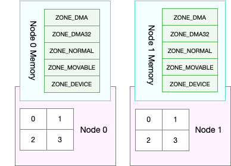

## 内存回收

缓存和缓冲区，就属于可回收内存。它们在内存管理中，通常被叫做**文件页（File-backed Page）**。

大部分文件页，都可以直接回收，以后有需要时，再从磁盘重新读取就可以了。而那些被应用程序修改过，并且暂时还没写入磁盘的数据（也就是脏页），就得先写入磁盘，然后才能进行内存释放。这些脏页，一般可以通过两种方式写入磁盘。

* 可以在应用程序中，通过系统调用 **fsync**，把脏页同步到磁盘中；
* 也可以交给系统，由内核线程 **pdflush** 负责这些脏页的刷新。


除了缓存和缓冲区，通过内存映射获取的文件映射页，也是一种常见的文件页。它也可以被释放掉，下次再访问的时候，从文件重新读取。

应用程序动态分配的堆内存，也就是我们在内存管理中说到的匿名页（Anonymous Page），是不是也可以回收呢？如果这些内存在分配后很少被访问，似乎也是一种资源浪费。是不是可以把它们暂时先存在磁盘里，释放内存给其他更需要的进程？

这正是 Linux 的 Swap 机制，把不常访问的内存先写到磁盘中，然后释放这些内存，给其他更需要的进程使用。再次访问这些内存时，重新从磁盘读入内存就可以了。

## Swap 原理

Swap 就是把一块磁盘空间或者一个本地文件（以下讲解以磁盘为例），当成内存来使用。它包括换出和换入两个过程。

* 所谓换出，就是把进程暂时不用的内存数据存储到磁盘中，并释放这些数据占用的内存。
* 而换入，则是在进程再次访问这些内存的时候，把它们从磁盘读到内存中来。


有新的大块内存分配请求，但是剩余内存不足。这个时候系统就需要回收一部分内存（比如前面提到的缓存），进而尽可能地满足新内存请求。这个过程通常被称为**直接内存回收**。

还有一个专门的内核线程用来定期回收内存，也就是 **kswapd0**。为了衡量内存的使用情况，kswapd0 定义了三个内存阈值（watermark，也称为水位），分别是页最小阈值（pages_min）、页低阈值（pages_low）和页高阈值（pages_high）。剩余内存，则使用 pages_free 表示。


kswapd0 定期扫描内存的使用情况，并根据剩余内存落在这三个阈值的空间位置，进行内存的回收操作。


* 剩余内存小于**页最小阈值**，说明进程可用内存都耗尽了，只有内核才可以分配内存。
* 剩余内存落在**页最小阈值**和**页低阈值中间**，说明内存压力比较大，剩余内存不多了。这时 kswapd0 会执行内存回收，直到剩余内存大于高阈值为止。
* 剩余内存落在**页低阈值**和**页高阈值**中间，说明内存有一定压力，但还可以满足新内存请求。
* 剩余内存大于**页高阈值**，说明剩余内存比较多，没有内存压力。


一旦剩余内存小于页低阈值，就会触发内存的回收。这个页低阈值，其实可以通过内核选项 `/proc/sys/vm/min_free_kbytes` 来间接设置。`min_free_kbytes` 设置了页最小阈值，而其他两个阈值，都是根据页最小阈值计算生成的，计算方法如下 ：

```shell
pages_low = pages_min*5/4
pages_high = pages_min*3/2
```

## active 和 inactive 内存页

缓存回收和 Swap 回收，实际上都是基于 LRU 算法，也就是优先回收不常访问的内存。LRU 回收算法，实际上维护着 active 和 inactive 两个双向链表，其中：

* active 记录活跃的内存页；
* inactive 记录非活跃的内存页。

越接近链表尾部，就表示内存页越不常访问。这样，在回收内存时，系统就可以根据活跃程度，优先回收不活跃的内存。

活跃和非活跃的内存页，按照类型的不同，又分别分为文件页和匿名页，对应着缓存回收和 Swap 回收。

你可以从 /proc/meminfo 中，查询它们的大小，比如：

```shell
# grep表示只保留包含active的指标（忽略大小写）
# sort表示按照字母顺序排序
$ cat /proc/meminfo | grep -i active | sort
Active(anon):     167976 kB
Active(file):     971488 kB
Active:          1139464 kB
Inactive(anon):      720 kB
Inactive(file):  2109536 kB
Inactive:        2110256 kB
```

## OOM

OOM 发生时，你可以在 dmesg 中看到 Out of memory 的信息，从而知道是哪些进程被 OOM 杀死了。

```shell
$ dmesg | grep -i "Out of memory"
Out of memory: Kill process 9329 (java) score 321 or sacrifice child
```

## NUMA 和 swap

很多情况下，你明明发现了 Swap 升高，可是在分析系统的内存使用时，却很可能发现，系统剩余内存还多着呢。为什么剩余内存很多的情况下，也会发生 Swap 呢？

这正是处理器的 NUMA （Non-Uniform Memory Access）架构导致的。

在 NUMA 架构下，多个处理器被划分到不同 Node 上，且每个 Node 都拥有自己的本地内存空间。

而同一个 Node 内部的内存空间，实际上又可以进一步分为不同的内存域（Zone），比如直接内存访问区（DMA）、普通内存区（NORMAL）、伪内存区（MOVABLE）等，如下图所示：




既然 NUMA 架构下的每个 Node 都有自己的本地内存空间，那么，在分析内存的使用时，我们也应该针对每个 Node 单独分析。

通过 numactl 命令，来查看处理器在 Node 的分布情况，以及每个 Node 的内存使用情况。比如，下面就是一个 numactl 输出的示例：

```bash
$ numactl --hardware
available: 1 nodes (0)
node 0 cpus: 0 1
node 0 size: 7977 MB
node 0 free: 4416 MB
...
```

这个界面显示，系统中只有一个 Node，也就是 Node 0 ，而且编号为 0 和 1 的两个 CPU， 都位于 Node 0 上。另外，Node 0 的内存大小为 7977 MB，剩余内存为 4416 MB。

前面提到的三个内存阈值（页最小阈值、页低阈值和页高阈值），都可以通过内存域在 proc 文件系统中的接口 `/proc/zoneinfo` 来查看。

```shell
$ cat /proc/zoneinfo
...
Node 0, zone   Normal
 pages free     227894
       min      14896
       low      18620
       high     22344
...
     nr_free_pages 227894
     nr_zone_inactive_anon 11082
     nr_zone_active_anon 14024
     nr_zone_inactive_file 539024
     nr_zone_active_file 923986
...
```

- pages 处的 min、low、high，就是上面提到的三个内存阈值，而 free 是剩余内存页数，它跟后面的 nr_free_pages 相同。
- nr_zone_active_anon 和 nr_zone_inactive_anon，分别是活跃和非活跃的匿名页数。
- nr_zone_active_file 和 nr_zone_inactive_file，分别是活跃和非活跃的文件页数。

从这个输出结果可以发现，剩余内存远大于页高阈值，所以此时的 kswapd0 不会回收内存。

某个 Node 内存不足时，系统可以从其他 Node 寻找空闲内存，也可以从本地内存中回收内存。具体选哪种模式，你可以通过 `/proc/sys/vm/zone_reclaim_mode` 来调整。它支持以下几个选项：

- 默认的 0 ，也就是刚刚提到的模式，表示既可以从其他 Node 寻找空闲内存，也可以从本地回收内存。
- 1、2、4 都表示只回收本地内存，2 表示可以回写脏数据回收内存，4 表示可以用 Swap 方式回收内存。

## swappiness

Linux 提供了一个 `/proc/sys/vm/swappiness` 选项，用来调整使用 Swap 的积极程度。

swappiness 的范围是 0-100，数值越大，越积极使用 Swap，也就是更倾向于回收匿名页；数值越小，越消极使用 Swap，也就是更倾向于回收文件页。

虽然 swappiness 的范围是 0-100，不过要注意，这并不是内存的百分比，而是调整 Swap 积极程度的权重，即使你把它设置成 0，[当剩余内存 + 文件页小于页高阈值时](https://www.kernel.org/doc/Documentation/sysctl/vm.txt)，还是会发生 Swap。

## 降低 swap 方法

* 禁止 Swap，现在服务器的内存足够大，所以除非有必要，禁用 Swap 就可以了。随着云计算的普及，大部分云平台中的虚拟机都默认禁止 Swap。
* 如果实在需要用到 Swap，可以尝试降低 swappiness 的值，减少内存回收时 Swap 的使用倾向。
* 响应延迟敏感的应用，如果它们可能在开启 Swap 的服务器中运行，你还可以用库函数 mlock() 或者 mlockall() 锁定内存，阻止它们的内存换出。


## 案例

```shell
$ free
             total        used        free      shared  buff/cache   available
Mem:        8169348      331668     6715972         696     1121708     7522896
Swap:             0           0           0
```

为了继续 Swap 的案例， 就需要先配置、开启 Swap。

要开启 Swap，我们首先要清楚，Linux 本身支持两种类型的 Swap，即 **Swap 分区**和 **Swap 文件**。以 Swap 文件为例，在第一个终端中运行下面的命令开启 Swap，我这里配置 Swap 文件的大小为 8GB：

```shell
# 创建Swap文件
$ fallocate -l 8G /mnt/swapfile
# 修改权限只有根用户可以访问
$ chmod 600 /mnt/swapfile
# 配置Swap文件
$ mkswap /mnt/swapfile
# 开启Swap
$ swapon /mnt/swapfile
```

```shell
$ free
             total        used        free      shared  buff/cache   available
Mem:        8169348      331668     6715972         696     1121708     7522896
Swap:       8388604           0     8388604
```

运行下面的 dd 命令，模拟大文件的读取：

```shell
# 写入空设备，实际上只有磁盘的读请求
$ dd if=/dev/sda1 of=/dev/null bs=1G count=2048
```

运行 sar 命令，查看内存各个指标的变化情况。你可以多观察一会儿，查看这些指标的变化情况。

```shell
# 间隔1秒输出一组数据
# -r表示显示内存使用情况，-S表示显示Swap使用情况
$ sar -r -S 1
04:39:56    kbmemfree   kbavail kbmemused  %memused kbbuffers  kbcached  kbcommit   %commit  kbactive   kbinact   kbdirty
04:39:57      6249676   6839824   1919632     23.50    740512     67316   1691736     10.22    815156    841868         4

04:39:56    kbswpfree kbswpused  %swpused  kbswpcad   %swpcad
04:39:57      8388604         0      0.00         0      0.00

04:39:57    kbmemfree   kbavail kbmemused  %memused kbbuffers  kbcached  kbcommit   %commit  kbactive   kbinact   kbdirty
04:39:58      6184472   6807064   1984836     24.30    772768     67380   1691736     10.22    847932    874224        20

04:39:57    kbswpfree kbswpused  %swpused  kbswpcad   %swpcad
04:39:58      8388604         0      0.00         0      0.00

…


04:44:06    kbmemfree   kbavail kbmemused  %memused kbbuffers  kbcached  kbcommit   %commit  kbactive   kbinact   kbdirty
04:44:07       152780   6525716   8016528     98.13   6530440     51316   1691736     10.22    867124   6869332         0

04:44:06    kbswpfree kbswpused  %swpused  kbswpcad   %swpcad
04:44:07      8384508      4096      0.05        52      1.27
```

可以看到，sar 的输出结果是两个表格，第一个表格表示内存的使用情况，第二个表格表示 Swap 的使用情况。其中，各个指标名称前面的 kb 前缀，表示这些指标的单位是 KB。

* kbcommit，表示当前系统负载需要的内存。它实际上是为了保证系统内存不溢出，对需要内存的估计值。%commit，就是这个值相对总内存的百分比。
* kbactive，表示活跃内存，也就是最近使用过的内存，一般不会被系统回收。
* kbinact，表示非活跃内存，也就是不常访问的内存，有可能会被系统回收。

可以看到，总的内存使用率（%memused）在不断增长，从开始的 23% 一直长到了 98%，并且主要内存都被缓冲区（kbbuffers）占用。具体来说：

* 刚开始，剩余内存（kbmemfree）不断减少，而缓冲区（kbbuffers）则不断增大，由此可知，剩余内存不断分配给了缓冲区。
* 一段时间后，剩余内存已经很小，而缓冲区占用了大部分内存。这时候，Swap 的使用开始逐渐增大，缓冲区和剩余内存则只在小范围内波动。

你可能困惑了，为什么缓冲区在不停增大？这又是哪些进程导致的呢？

显然，我们还得看看进程缓存的情况。在前面缓存的案例中我们学过， cachetop 正好能满足这一点。那我们就来 cachetop 一下。

行下面的 cachetop 命令

```shell
$ cachetop 5
12:28:28 Buffers MB: 6349 / Cached MB: 87 / Sort: HITS / Order: ascending
PID      UID      CMD              HITS     MISSES   DIRTIES  READ_HIT%  WRITE_HIT%
   18280 root     python                 22        0        0     100.0%       0.0%
   18279 root     dd                  41088    41022        0      50.0%      50.0%
```

通过 cachetop 的输出，我们看到，dd 进程的读写请求只有 50% 的命中率，并且未命中的缓存页数（MISSES）为 41022（单位是页）。这说明，正是案例开始时运行的 dd，导致了缓冲区使用升高。

为什么 Swap 也跟着升高了呢？直观来说，缓冲区占了系统绝大部分内存，还属于可回收内存，内存不够用时，不应该先回收缓冲区吗？

这种情况，我们还得进一步通过 /proc/zoneinfo  ，观察剩余内存、内存阈值以及匿名页和文件页的活跃情况。

```shell
# -d 表示高亮变化的字段
# -A 表示仅显示Normal行以及之后的15行输出
$ watch -d grep -A 15 'Normal' /proc/zoneinfo
Node 0, zone   Normal
  pages free     21328
        min      14896
        low      18620
        high     22344
        spanned  1835008
        present  1835008
        managed  1796710
        protection: (0, 0, 0, 0, 0)
      nr_free_pages 21328
      nr_zone_inactive_anon 79776
      nr_zone_active_anon 206854
      nr_zone_inactive_file 918561
      nr_zone_active_file 496695
      nr_zone_unevictable 2251
      nr_zone_write_pending 0
```

发现，剩余内存（pages_free）在一个小范围内不停地波动。当它小于页低阈值（pages_low) 时，又会突然增大到一个大于页高阈值（pages_high）的值。

再结合刚刚用 sar 看到的剩余内存和缓冲区的变化情况，我们可以推导出，剩余内存和缓冲区的波动变化，正是由于内存回收和缓存再次分配的循环往复。

* 当剩余内存小于页低阈值时，系统会回收一些缓存和匿名内存，使剩余内存增大。其中，缓存的回收导致 sar 中的缓冲区减小，而匿名内存的回收导致了 Swap 的使用增大。
* 紧接着，由于 dd 还在继续，剩余内存又会重新分配给缓存，导致剩余内存减少，缓冲区增大。

换句话说，系统回收内存时，有时候会回收更多的文件页，有时候又回收了更多的匿名页。

显然，系统回收不同类型内存的倾向，似乎不那么明显。

运行下面的命令，查看 swappiness 的配置：

```bash
$ cat /proc/sys/vm/swappiness
60
```

swappiness 显示的是默认值 60，这是一个相对中和的配置，所以系统会根据实际运行情况，选择合适的回收类型，比如回收不活跃的匿名页，或者不活跃的文件页。

到这里，我们已经找出了 Swap 发生的根源。另一个问题就是，刚才的 Swap 到底影响了哪些应用程序呢？换句话说，Swap 换出的是哪些进程的内存？

推荐 proc 文件系统，用来查看进程 Swap 换出的虚拟内存大小，它保存在 /proc/pid/status 中的 VmSwap 中（推荐你执行 man proc 来查询其他字段的含义）。

```bash
# 按VmSwap使用量对进程排序，输出进程名称、进程ID以及SWAP用量
$ for file in /proc/*/status ; do awk '/VmSwap|Name|^Pid/{printf $2 " " $3}END{ print ""}' $file; done | sort -k 3 -n -r | head
dockerd 2226 10728 kB
docker-containe 2251 8516 kB
snapd 936 4020 kB
networkd-dispat 911 836 kB
polkitd 1004 44 kB
```

```shell
$ smem --sort swap
```
使用 Swap 比较多的是 dockerd 和 docker-containe 进程，所以，当 dockerd 再次访问这些换出到磁盘的内存时，也会比较慢。

这也说明了一点，虽然缓存属于可回收内存，但在类似大文件拷贝这类场景下，系统还是会用 Swap 机制来回收匿名内存，而不仅仅是回收占用绝大部分内存的文件页。

如果你在一开始配置了 Swap，不要忘记在案例结束后关闭。你可以运行下面的命令，关闭 Swap：

```shell
# 进程按照swap使用量排序显示
$ swapoff -a
```

实际上，关闭 Swap 后再重新打开，也是一种常用的 Swap 空间清理方法，比如

```shell
$ swapoff -a && swapon -a 
```